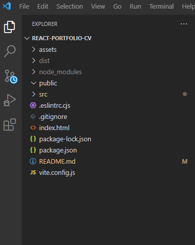

# React-Portfolio-CV

Hello!! Welcome to my Portfolio.

## Table of Contents:
* [Introduction](#introduction)
* [Installation](#installation)
* [Resources](#resources)
* [License](#license)

## Introduction

A Career,  regardless of whether it's in the realm of professional artistry or web development,necessitates the inclusion of a portfolio website.This website will serve as a central hub where potential employers can easily peruse your work and get to know you better. 

Additionally, it offers an excellent opportunity to display your skills and accomplishments effectively.

- You can showcase your work
- Attract new clients
- Helps to build your personal brand
- Helps you build credibility

# Installation

1. To get started with this project, you can clone the repository to your local machine.
2. Navigate to the project directory
3. Install the required software components
4. Start the application

# Resources 

Here are some useful resources related to this project:

- [W3C HTML Specification](https://www.w3.org/TR/html52/): The official HTML specification by the World Wide Web Consortium.
- [Stack Overflow](https://stackoverflow.com): Get answers to common questions and issues related to this project.

- [GitHub Issues](https://support.github.com/features/issues): Report issues and request assistance.

# License

This project is licensed under the MIT License. See the [LICENSE](LICENSE) file for details.

> [!NOTE]

#### Support 

If you have any questions or need assistance, feel free to reach out to me on my email 2akssultana@gmail.com.

> [!IMPORTANT]

The tools that have been added in this project:
- React
- Navigation with React Router
- Contact links
- Contact form for handling events
- LinkedIn Profile with the new skills updated

> [!URL]

- [Deployed application](https://2akia.github.io/React-Portfolio-CV/)
- [Git Hub repo](https://github.com/2akia/React-Portfolio-CV)

Thank you for having a look.

## Copyright

© 2024 Jakia sultana - All Rights Reserved.
